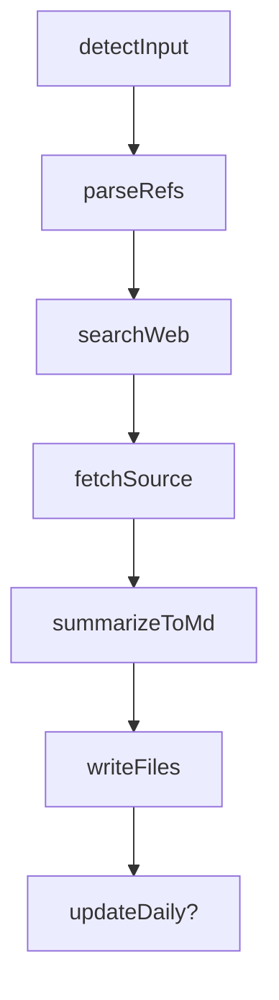

# news/source* → 论文原文抓取与摘要（news-paper-source）

本 skill 在已有的 `news-doc-to-md` 基础上，负责**从 Markdown 汇总中自动追踪论文/综述原文**，并为每篇论文生成一份结构化的**中文摘要 Markdown**，归档到 `news/papers/` 目录。

---

## 一、目标与适用场景

- **目标**
  - 从 `news/source-from-doc.md` 或 `news/source-daily.md` 中识别被提到的论文 / 综述 / 长文。
  - 在线搜索这些论文/文章的**原始来源页面**（优先 arXiv / openreview / 实验室博客等公开站点）。
  - 基于原文内容 + 仓库内已有的中文整理，**用自己的语言写出结构化中文摘要 Markdown**，避免逐句翻译或大段拷贝。
  - 将摘要按篇写入 `news/papers/<slug>.md`，便于后续在 docs 或公众号文章中引用。
- **典型触发场景**
  - 用户已通过 `news-doc-to-md` 从 `news/source.docx` 得到 `news/source-from-doc.md`，希望继续「逐篇追踪论文原文」。
  - 用户编辑了 `news/source-daily.md` 当日汇总，文末点明若干论文/综述，希望为这些工作分别建立**论文笔记**。
  - 用户在对话中提到「从 daily 里自动找这些论文原文」「帮我把 daily 里的论文整理成单篇笔记」等。

---

## 二、前置条件与依赖

- **文件前置**
  - 优先输入：`news/source-from-doc.md`（由 `news-doc-to-md` 生成）。
  - 备选输入：`news/source-daily.md`（当日汇总）。
  - 若两者都不存在：说明 Word→Markdown 尚未执行，应提示用户**先运行 `news-doc-to-md`**。
- **工具依赖**
  - 使用 `Read` / `Grep`：
    - 读取 `news/source-from-doc.md`、`news/source-daily.md` 内容。
  - 使用 `WebSearch`：
    - 按论文/综述标题、工作名、机构等关键词搜索原文页面。
  - 使用 `WebFetch`：
    - 抓取 HTML 论文摘要页或文章页内容，作为摘要依据之一。
  - 使用 `ApplyPatch`：
    - 新建或更新 `news/papers/<slug>.md`。
    - 可选更新 `news/source-daily.md` 中的「延伸阅读」小节。
- **路径约定**
  - 所有路径使用**仓库根目录相对路径 + 正斜杠**，例如：
    - `news/source-from-doc.md`
    - `news/source-daily.md`
    - `news/papers/x-vla-soft-prompted-transformer.md`

---

## 三、整体流程总览



- **detectInput**：确认本次输入 Markdown 文件及其存在性。
- **parseRefs**：从输入 Markdown 中抽取候选论文/综述引用列表。
- **searchWeb**：针对每个候选使用 `WebSearch` 查找最可能的原文页面。
- **fetchSource**：对选定页面使用 `WebFetch` 抓取 HTML 内容（若只有 PDF，则退化为仅用摘要页 + 本地整理）。
- **summarizeToMd**：基于原文 & 本地整理写出结构化中文摘要。
- **writeFiles**：将摘要写入 `news/papers/<slug>.md`，并处理去重/更新。
- **updateDaily?**：可选，在 `news/source-daily.md` 末尾维护「延伸阅读」区块。

---

## 四、Step 0：输入文件检测（detectInput）

1. **检查 `news/source-from-doc.md` 是否存在**
   - 若存在：作为默认输入文件。
2. **否则检查 `news/source-daily.md`**
   - 若存在：作为备选输入文件。
3. **若两个都不存在**
   - 在对话中说明：
     - 「未找到 `news/source-from-doc.md` 或 `news/source-daily.md`，请先将 Word 文档通过 `news-doc-to-md` 转为 Markdown，再运行本 skill。」
   - 终止本 skill。

在接下来的步骤中，将「当前输入文件」统一称为 `input_md`。

---

## 五、Step 1：论文 / 综述引用识别（parseRefs）

### 5.1 典型模式

在 `input_md` 中，论文/综述/长文通常以以下几种方式出现（以现有 `news/source-daily.md` 为例）：

- **模式 A：显式论文标题 +「arXiv 论文」字样**
  - 示例：`arXiv 论文《X-VLA: Soft-Prompted Transformer as Scalable Cross-Embodiment Vision-Language-Action Model》`
  - 特征：
    - 使用全角书名号 `《...》` 或引号 `"..."`
    - 附近出现 `arXiv`、`论文`、`paper` 等关键词。
- **模式 B：代表工作名 + 机构**
  - 示例：`SparseVideoNav（OpenDriveLab）`、`NavDreamer（浙江大学）`、`ABot-N0`、`GTA（Guide Them All）`、`LongNav-R1` 等。
  - 特征：
    - 名称通常较短，含大小写字母/数字/连字符；
    - 可能跟随括号内机构/单位，如 `（OpenDriveLab）`。
- **模式 C：中文综述/长文标题**
  - 示例：`《VLN范式大洗牌｜10篇力作，拆解2026年VLN四大核心突破方向》`
  - 特征：
    - 多为中文书名号包裹；
    - 附近出现 `综述`、`长文`、`文章`、`速览` 等词。

### 5.2 启发式抽取规则

在实现时，建议使用「正则 + 语义判断」的组合，而不是只靠一种模式：

1. **优先匹配带书名号或引号的标题片段**
   - 识别 `《...》`、`“...”` 等模式；
   - 限制长度（例如 5–200 字符之间），避免整段被吃进去。
   - 检查标题前后是否出现以下关键词之一：
     - `arXiv`、`论文`、`paper`、`preprint`；
     - `综述`、`survey`、`长文`。
2. **识别短工作名 + 上下文**
   - 针对大写/驼峰/带连字符的短词，如：`X-VLA`、`SparseVideoNav`、`NavDreamer`、`LongNav-R1` 等；
   - 若名称附近（同一段或相邻几行）出现：
     - `提出了`、`工作`、`方法`、`模型`、`paper` 等信息，
     - 或出现在「代表工作」「风向一/二/三/四」的小节下，
     - 则将其视为候选论文/项目名。
3. **关键小节下的代表工作列表**
   - 对于形如 `## VLN 范式大洗牌：2026 年四大突破方向速览` 的小节：
     - 在其正文中出现的带大写缩写或特定命名（如 `ABot-N0`、`GTA`、`DACo`、`LongNav-R1`、`NaVIDA` 等），
     - 都可以作为该领域的候选论文条目。

### 5.3 结构化候选条目

对每个被识别出来的候选，形成结构化数据：

- `title_raw`：原文中出现的完整标题/名称字符串。
- `hint_keywords`：从周边上下文中提取的附加信息：
  - 机构/团队（如 `OpenDriveLab`、`高德地图`）；
  - 领域/任务（如 `VLN`、`navigation`、`X-VLA`）；
  - 年份（如 `2026`）。
- `type`：粗略类别，常见取值：
  - `paper`：正式论文或技术报告。
  - `survey`：综述或长文总结。
  - `blog`：博客/新闻稿/公众号文章等。

在对话或日志中，给出类似清单，方便用户理解本次会处理哪些论文：

- `[1] X-VLA: Soft-Prompted Transformer as Scalable Cross-Embodiment Vision-Language-Action Model (paper)`
- `[2] VLN范式大洗牌｜10篇力作，拆解2026年VLN四大核心突破方向 (survey/article)`
- `[3] SparseVideoNav (paper)` 等。

---

## 六、Step 2：在线检索与来源选择（searchWeb & fetchSource）

### 6.1 WebSearch 检索策略

对每个候选条目，基于其 `type`、`title_raw`、`hint_keywords` 组合构造查询：

- **英文论文标题明显的情况**
  - 查询样例：
    - `"<英文标题>" arxiv`
    - `"<英文标题>" paper`
  - 目标：优先命中 arXiv/openreview/期刊官网中的论文页面。
- **中文综述/文章标题**
  - 查询样例：
    - `"<中文标题>" 具身智能`
    - `"<中文标题>" VLN`
  - 目标：找到原作者发布的渠道（如公众号、机构博客、medium 等），而非二手转载。
- **只有工作名的情况（如 SparseVideoNav、NavDreamer 等）**
  - 查询样例：
    - `SparseVideoNav VLN navigation arxiv`
    - `NavDreamer video navigation paper`
  - 若 `hint_keywords` 中包含机构或年份，可一并加入查询。

### 6.2 结果筛选与优先级

在 WebSearch 返回的候选结果中，优先考虑：

1. **公开可访问的 HTML 页面**
   - arXiv、openreview、期刊页面的「abstract」页；
   - 实验室官方博客、项目主页；
   - 作者个人主页中的介绍页。
2. **信息完整、权威度高**
   - 含有摘要、方法简介、实验结果摘要等关键信息；
   - 避免只含标题和若干无关广告的聚合站。

对每个候选，记录：

- `primary_url`：最终选定的主来源链接。
- `alt_urls`：可选的其它较可靠链接列表。

### 6.3 WebFetch 抓取与 PDF 限制

- 对选定的 `primary_url`：
  - 若是 HTML 论文摘要/文章页：
    - 使用 `WebFetch` 抓取页面；
    - 从返回的 Markdown 式正文中提取：
      - 标题、作者、年份、会议/期刊；
      - 问题背景、方法简介、实验结果等信息。
  - 若只有 PDF 链接（或 HTML 内容极少）：
    - 通常无法直接抓取 PDF 正文；
    - 回退策略：
      - 仅依赖页面上的标题、简短摘要等有限信息；
      - 结合 `input_md` 中已有的中文整理，共同生成摘要；
      - 在输出 Markdown 的 `note` 中明确标注「基于公开摘要与二手资料的整理」。

---

## 七、Step 3：生成结构化中文摘要 Markdown（summarizeToMd）

### 7.1 内容原则

- **不逐句翻译、不大段搬运原文**：
  - 避免超过合理篇幅的逐句直译；
  - 仅在必要处引用少量关键术语/短语。
- **用自己的话做结构化整理**：
  - 以「问题—方法—实验—启发」四段式为主线；
  - 保持技术准确性，同时面向具身智能/机器人方向读者。
- **信息来源组合**：
  - 原文页面抓取内容（标题、摘要、介绍等）；
  - `input_md` 中已有的中文整理和上下文；
  - 必要时进行合理推断，但要避免虚构具体数值/图表。

### 7.2 推荐输出模板（写入 news/papers/<slug>.md）

前置的 YAML 元信息区：

```markdown
---
title: <论文英文标题或中文标题>
alias: [可选别名列表，如 X-VLA]
authors: [作者列表，尽量保留英文顺序]
year: 2026
venue: arXiv
primary_url: <主来源链接>
alt_urls:
  - <其它候选链接 1>
  - <其它候选链接 2>
source_from: news/source-daily.md  # 或 news/source-from-doc.md
note: 本文为基于原文及公开摘要的中文结构化整理，非逐句翻译
---
```

正文结构示例：

```markdown
# <中文标题：可用简洁记忆点>

> *一两句导语：说明这篇工作在解决什么问题、为什么值得关注。*

## 一、这篇工作的核心问题
- 用自己的话，解释原文试图解决的核心场景和挑战。

## 二、方法与关键设计
- 先一句话概括整体思路。
- 再用 3–5 个小点展开：
  - 关键模块/架构设计；
  - 训练策略或数据配方；
  - 特别的技巧（如 Soft Prompt、Flow-Matching 等）。

## 三、实验设置与主要结果
- 简要交代数据集/平台/任务设置；
- 列出 2–4 条关键结果或对比结论；
- 特别指出与 SOTA 的差异和优势。

## 四、对具身智能/机器人生态的启发
- 提炼 2–4 条对工程或研究有启发的观点；
- 可结合本项目（Xbotics-Embodied-Guide）的关注点点评：
  - 如「跨机器人软提示的可扩展性」、「VLN 与 VLA 的融合趋势」等。

## 五、延伸链接
- [原文：<英文标题>](<primary_url>)
- [作者/项目主页（若有）](<alt_or_extra_url>)
- [本仓库中相关整理（如当日汇总）](../source-daily.md)

> *本摘要仅保留对具身智能方向较关键的核心内容，推荐与原文一起阅读。*
```

### 7.3 图表与公式的处理

- 不直接下载或嵌入原文图片，仅在文字中**概述图表含义**：
  - 可使用小节/列表说明「图 1 主要展示什么」「图 2 对比了哪些方法」。
- 对复杂公式：
  - 尽量用自然语言解释其含义和作用；
  - 只有在确有必要时，用简短的 LaTeX 片段记录关键符号含义。

---

## 八、Step 4：文件命名与写入（writeFiles）

### 8.1 目录与命名规则

- **目录约定**
  - 所有论文摘要文件统一写入：
    - `news/papers/`
  - 若目录不存在，可在执行前通过 Shell 或 ApplyPatch 新建。

- **slug 生成规则**
  - 以论文英文标题或主要工作名为基础：
    - 全部转为小写；
    - 将非字母数字字符全部替换为短横线 `-`；
    - 连续多个 `-` 合并为一个；
    - 去除开头和结尾的 `-`。
  - 示例：
    - `X-VLA: Soft-Prompted Transformer as Scalable Cross-Embodiment Vision-Language-Action Model`
      → `x-vla-soft-prompted-transformer-as-scalable-cross-embodiment-vision-language-action-model.md`
    - `VLN范式大洗牌｜10篇力作，拆解2026年VLN四大核心突破方向`
      → 可手动/半自动优化为 `vln-2026-paradigm-shift-survey.md`。

### 8.2 去重与更新策略

- 若 `news/papers/<slug>.md` 尚不存在：
  - 使用 `ApplyPatch` 新建该文件，写入上述 frontmatter 与正文模板内容。
- 若文件已存在：
  - 默认**不直接整体覆盖**，而是：
    - 更新 frontmatter 中的 `primary_url`、`alt_urls`、`note` 等元信息；
    - 视情况更新正文中的某些小节（例如补充新的实验结果或启发），避免破坏人工已做的细致编辑。
  - 如需保留旧版本，可在覆盖前创建备份文件：
    - `news/papers/<slug>-backup-YYYYMMDD.md`。

---

## 九、Step 5：与 news/source-daily.md 的联动（updateDaily?）

本步骤为**可选增强**，在主流程成功生成若干 `news/papers/*.md` 后执行。

### 9.1 延伸阅读小节结构

在 `news/source-daily.md` 的末尾维护一个「延伸阅读」小节，形如：

```markdown
## 延伸阅读

- [X-VLA 原文摘要](papers/x-vla-soft-prompted-transformer.md)
- [VLN 范式大洗牌综述摘要](papers/vln-2026-paradigm-shift-survey.md)
```

### 9.2 更新策略

1. **收集本次生成/更新的摘要文件列表**
   - 根据 slug 与标题，生成适合展示的中文链接文本；
   - 例如：`X-VLA 原文摘要`、`VLN 范式大洗牌综述摘要`。
2. **读取 `news/source-daily.md` 当前内容**
   - 若不存在「## 延伸阅读」小节：
     - 在文末追加一个新的小节，并插入本次列表。
   - 若已存在「## 延伸阅读」：
     - 解析该小节中的现有条目；
     - 合并本次新条目，避免重复；
     - 建议排序策略：
       - 主线论文在前（如 X-VLA 等与当天主线最相关的工作）；
       - 综述/相关工作在后。

---

## 十、错误处理与边界情况

- **未找到任何候选论文/综述**
  - 在对话中说明：
    - 「在当前 `input_md` 中未识别到明显的论文/综述标题或工作名，可能是文档尚未按论文结构整理，或只包含高层讨论。」  
  - 结束本 skill。
- **WebSearch 未找到合适来源**
  - 可退而仅基于 `input_md` 中的内容生成一份「二手信息基础上的摘要」；
  - 在 `note` 中明确说明「暂未找到官方原文链接，仅基于当前整理内容生成」。
- **WebFetch 抓取失败或站点需要登录**
  - 不再反复尝试登录/绕过限制；
  - 回到「仅用可见摘要 + 本地整理内容」的模式，降低细节粒度。
- **网络不可用**
  - 所有依赖 WebSearch/WebFetch 的步骤暂时跳过；
  - 可以只做 Step 1 的引用识别，在对话中给出「候选论文清单」，提示稍后在网络恢复后再做抓取与整理。

---

## 十一、小结

- 本 skill 将 `news/source.docx → Markdown` 之后的「论文追踪」自动化：  
  - 从 `news/source-from-doc.md` / `news/source-daily.md` 中识别论文/综述；
  - 在线搜索原文页面，使用 WebSearch/WebFetch 获取关键信息；
  - 生成结构化的中文摘要 Markdown，归档在 `news/papers/`；
  - 可选同步更新每日汇总中的「延伸阅读」区块。
- 对用户而言，这提供了一条「**Word 汇总 → 当日中文速览 → 单篇论文笔记**」的自然路径，方便后续在 docs 中深度引用或继续扩展。

---

## 十二、可选输出：论文速递公众号格式（Digest）

当用户明确说明「在公众号写论文速递」「每篇一个单独章节」「采用 No. 01 | 标题 + 英文原题 + 关键词 + 一句话简介 + 核心创新点 + 图 + 资源链接 的格式」时，本 skill 还应在完成前述 `news/papers/*.md` 摘要后，额外生成一篇**论文速递 Digest**，默认写入：

- `news/source-daily.md`

### 12.1 整体结构

- 顶部有一段总导读，示例：

  ```markdown
  本期导读：今日收录 10 篇精选论文。重点关注 XXX、YYY 和 ZZZ 等方向的最新进展。
  ```

  - 其中「10」应根据本次识别到的论文篇数自动替换；
  - 「重点关注 …」可基于本次论文主题，简要概括 1–2 句核心趋势（例如：长文本处理 / 机器人精细控制 / VLN 视角鲁棒性等）。
- 同时在对话回复中额外给出 2–3 个适合作为整篇公众号主标题的中文标题候选（不必写入 `news/source-daily.md`，供用户在公众号后台自行选择）。

### 12.2 单篇论文章节格式

- 每篇论文对应一个独立小节，采用如下模板（示例为 Ring-Attention 2.0，实际内容需结合当前论文改写）：

  ```markdown
  No. 01 | 突破长文本瓶颈：Ring-Attention 2.0
  英文原题： Ring-Attention 2.0: Scaling Sequence Length to Millions via Improved Block Parallelism
  关键词： #长文本处理 / #分布式训练 / #LLM

  💡 一句话简介：
  通过改进环形注意力机制，让模型在不增加显存压力的前提下，支持处理超过 100 万 token 的超长序列。

  ✨ 核心创新点：

  - 通信优化：提出异步块交换协议，将计算与通信高度重叠（overlap），减少分布式训练中的等待时间。
  - 计算复杂度：优化自注意力的分块逻辑，在 \(O(n^2)\) 理论复杂度下，通过硬件友好的实现获得近似线性扩展。
  - 性能提升：在 Needle In A Haystack 等长文本基准上，百万级长度下的检索准确率保持在 99.5% 以上。

  🖼️ 关键架构/效果图：
  ![Ring-Attention 2.0 架构图：展示了 Token 在不同 GPU 核心间的流转路径]
  图 1：Ring-Attention 2.0 的环形通信拓扑结构

  🔗 资源链接：
  Paper: [arXiv:2602.12345](https://arxiv.org/abs/2602.12345)
  Code: [github.com/google-research/ring-attn](https://github.com/google-research/ring-attn)
  ```

- 实际生成时，应按以下原则进行改写：
  - **No. XX 递增编号**：按识别顺序或重要程度排序，从 `No. 01` 开始；
  - **中文标题**：不是简单翻译，而是结合论文亮点写成有记忆点的短标题（例如「一站式端到端机器人学习库 LeRobot」「视角不变 VLN：连续环境中的鲁棒导航」等）；
  - **关键词**：使用 `#标签` 形式，2–4 个，覆盖领域、任务和方法（如 `#机器人学习 / #端到端控制 / #开源库`）。

### 12.3 内容要求

- **💡 一句话简介**：  
  - 1–2 句中文，面向公众号读者，快速交代这篇论文解决了什么问题、最大的亮点是什么。
- **✨ 核心创新点**：  
  - 用 3–5 条 bullet 归纳方法或贡献，避免逐段翻译；
  - 每条尽量「一个点一个信息」，优先描述：新设定 / 新框架 / 关键模块 / 主要实验发现。
- **🖼️ 关键图与本地路径约定**：  
  - 所有配图文件一律放在仓库的 `news/images/` 目录下，例如 `news/images/lerobot-arch.png`、`news/images/vil-framework.png`；  
  - 在 `news/source-daily.md` 中引用时，统一使用**相对 `news/` 目录的路径**，形如：
    - ``
    - ``  
  - 若本地已有对应配图（可以来自论文原图、自己绘制的示意图或 `news/source-from-doc-media/` 抽取后手动保存到 `news/images/`），应优先使用真实图片路径而不是空占位，并在 Digest 正文中插入实际的 `` 标记；  
  - 若暂时没有合适图片，也可以先保留纯文字占位，后续再在 `news/images/` 中补图并更新路径，此时时不要伪造不存在的图片路径。
- **🔗 资源链接**：  
  - Paper：优先使用 `arxiv.org/abs/...` 链接；
  - Code：若有 GitHub 或项目主页，写入对应链接；
  - 禁止虚构不可公开访问的链接。

### 12.4 生成后的图片检查（必做）

- 在完成 `news/source-daily.md` 生成后，应做一次快速检查：
  - 确认文中所有 `](images/xxx)` 引用的图片文件，在 `news/images/` 目录下实际存在；  
  - 若发现缺失：
    - 在对话中明确提示用户「以下图片文件尚未放入 `news/images/`：...」，并列出文件名清单；  
    - 暂不删除对应 Markdown 引用，由用户在补图后再次预览或重新触发整理流程。

生成完成后，`news/source-daily.md` 即可直接作为「论文速递」公众号推文的基础稿件，用户可在此基础上微调导语、配图与排版。

