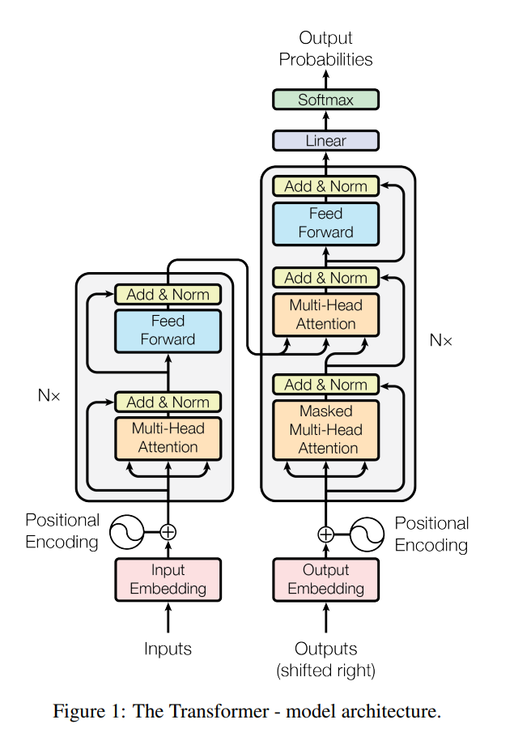

# 3. 基础学习（机器人基础｜深度学习基础）

## 3.1 机器人学打底：坐标系/运动学/动力学/控制

### 坐标系与位姿变换

机器人要在三维空间中精确操作，首先得搞清楚怎么描述"物体在哪里"和"姿态是什么样"。就像你要告诉别人一个东西的位置，得先说清楚参考点在哪。

**坐标系的基本概念**

在机器人学里，常用的坐标系有这么几个：
- **世界坐标系 {W}**：这是整个系统的绝对参考，固定不动。通常把它放在地面某个角落，所有其他物体的位置都是相对于它来描述的。比如工厂里可能选车间的西南角作为原点。
- **基座坐标系 {B}**：固定在机器人基座上，是机器人自己的参考系。机器人的所有关节和连杆位置都可以相对于基座来描述。
- **工具坐标系 {T}**：建立在机器人末端执行器上，比如夹爪的中心点。当机器人要抓东西时，实际上就是让工具坐标系和目标物体坐标系对齐。
- **物体坐标系 {O}**：每个要操作的物体都有自己的坐标系，通常选在物体的质心或者某个便于描述的特征点上。

**位姿的数学表示**

一个刚体在空间中的状态包括两部分：
1. **位置**：用3个数描述(x, y, z)，代表平移
2. **姿态**：用3个角度描述绕各轴的旋转

但直接用欧拉角有万向锁问题（某些角度下会失去一个自由度），所以机器人学里更喜欢用**旋转矩阵**。

旋转矩阵R是个3×3的矩阵，每一列表示新坐标系的一个轴在原坐标系中的方向：
$$R = \begin{bmatrix}
x_{新} & y_{新} & z_{新}
\end{bmatrix} = \begin{bmatrix}
r_{11} & r_{12} & r_{13} \\
r_{21} & r_{22} & r_{23} \\
r_{31} & r_{32} & r_{33}
\end{bmatrix}$$

这个矩阵必须满足正交性（$R^TR = I$）和行列式为1（$\det(R) = 1$），保证它只做旋转不做缩放或镜像。

**齐次变换矩阵——统一旋转和平移**

如果分开处理旋转和平移，计算会很麻烦。齐次变换矩阵把两者合并到一个4×4矩阵里：

$$T = \begin{bmatrix}
R_{3×3} & P_{3×1} \\
0_{1×3} & 1
\end{bmatrix} = \begin{bmatrix}
r_{11} & r_{12} & r_{13} & p_x \\
r_{21} & r_{22} & r_{23} & p_y \\
r_{31} & r_{32} & r_{33} & p_z \\
0 & 0 & 0 & 1
\end{bmatrix}$$

左上角3×3是旋转，右上角3×1是平移，左下角是[0 0 0]，右下角恒为1。

这样一来，原本"先旋转再平移"的两步操作，现在变成一次矩阵乘法。比如点p在坐标系A中的坐标是$p_A = [x_A, y_A, z_A, 1]^T$，要转换到坐标系B：
$$p_B = T_{BA} \cdot p_A$$

**串联变换——机械臂的数学基础**

对于串联机械臂，从基座到末端要经过多个关节。每个关节都有自己的坐标系，相邻坐标系之间的变换用一个齐次矩阵表示。从基座{0}到末端{n}的总变换就是：
$$T_0^n = T_0^1 \cdot T_1^2 \cdot T_2^3 \cdots T_{n-1}^n$$

矩阵相乘的顺序很重要，从右往左理解：先从n-1变到n，再从n-2变到n-1，一直到从0变到1。

### 正逆运动学——关节与末端的映射

运动学研究的是位置、速度、加速度等几何量，不涉及力。核心问题是关节空间（各个电机的角度）和笛卡尔空间（末端在3D空间的位置）之间的转换。

**正运动学（Forward Kinematics, FK）**

给定所有关节的角度$q = [\theta_1, \theta_2, ..., \theta_n]^T$，计算末端执行器的位姿。这个比较直接，就是把所有变换矩阵连乘。

以最简单的平面二连杆机械臂为例：
- 第一个杆长$L_1$，转角$\theta_1$
- 第二个杆长$L_2$，相对第一个杆的转角$\theta_2$

末端位置的计算：
```
x = L1*cos(θ1) + L2*cos(θ1+θ2)
y = L1*sin(θ1) + L2*sin(θ1+θ2)
姿态角 φ = θ1 + θ2
```

画个图就很清楚：第一个杆的末端在$(L_1\cos\theta_1, L_1\sin\theta_1)$，第二个杆从这里出发，再延伸$L_2$的长度，方向是$\theta_1+\theta_2$。

**逆运动学（Inverse Kinematics, IK）**

这个问题反过来：知道想让末端到达位置(x, y)，求需要的关节角度$\theta_1$和$\theta_2$。

几何法求解过程：
1. 用余弦定理，从末端到基座的直线距离是$r = \sqrt{x^2+y^2}$
2. 三角形三边分别是$L_1$、$L_2$、$r$，用余弦定理：
   $$\cos\theta_2 = \frac{x^2+y^2-L_1^2-L_2^2}{2L_1L_2}$$
3. 因为$-1 \leq \cos\theta_2 \leq 1$，所以当$r > L_1+L_2$或$r < |L_1-L_2|$时无解
4. $\theta_2 = \pm\arccos(...)$，正负对应"肘部向上"和"肘部向下"两种构型
5. 求出$\theta_2$后，代入正运动学方程求$\theta_1$

逆运动学的三大难题：
- **无解**：目标点在工作空间外，机械臂够不着
- **多解**：同一个位置有多种到达方式（比如肘部向上/向下）
- **奇异点**：某些特殊位形下，机械臂失去一个或多个自由度。比如手臂完全伸直时，无法在径向移动

### DH参数法——标准化的机械臂描述

Denavit-Hartenberg方法用四个参数系统化描述相邻连杆的几何关系。好处是对任何串联机械臂都适用，而且参数数量最少。

**DH参数的定义**

对于第i个关节：
1. **连杆长度 $a_i$**：沿着$x_i$轴，从$z_{i-1}$轴到$z_i$轴的距离
2. **连杆扭角 $\alpha_i$**：绕着$x_i$轴，从$z_{i-1}$轴转到$z_i$轴的角度
3. **连杆偏距 $d_i$**：沿着$z_{i-1}$轴，从$x_{i-1}$到$x_i$的距离（对于移动关节是变量）
4. **关节角 $\theta_i$**：绕着$z_{i-1}$轴，从$x_{i-1}$转到$x_i$的角度（对于转动关节是变量）

每个关节的齐次变换矩阵可以分解为四个基本变换：
$$T_{i-1}^i = Rot_z(\theta_i) \cdot Trans_z(d_i) \cdot Trans_x(a_i) \cdot Rot_x(\alpha_i)$$

展开后是：
$$T_{i-1}^i = \begin{bmatrix}
\cos\theta_i & -\sin\theta_i\cos\alpha_i & \sin\theta_i\sin\alpha_i & a_i\cos\theta_i \\
\sin\theta_i & \cos\theta_i\cos\alpha_i & -\cos\theta_i\sin\alpha_i & a_i\sin\theta_i \\
0 & \sin\alpha_i & \cos\alpha_i & d_i \\
0 & 0 & 0 & 1
\end{bmatrix}$$

**建立DH参数表的步骤**

1. 定义z轴：每个$z_i$沿着第i+1个关节的旋转轴
2. 定义原点：$z_{i-1}$和$z_i$的公垂线与$z_{i-1}$的交点
3. 定义x轴：$x_i$沿着$z_{i-1}$和$z_i$的公垂线，从$z_{i-1}$指向$z_i$
4. 测量四个参数，填表

举个例子，SCARA机器人（常用于装配）的DH参数表：
| 关节 | $\theta_i$ | $d_i$ | $a_i$ | $\alpha_i$ |
|------|------------|-------|-------|------------|
| 1 | $\theta_1$(变量) | $d_1$ | $a_1$ | 0 |
| 2 | $\theta_2$(变量) | 0 | $a_2$ | 0 |
| 3 | 0 | $d_3$(变量) | 0 | 0 |
| 4 | $\theta_4$(变量) | $d_4$ | 0 | 0 |

前两个关节做平面运动，第三个是垂直移动，第四个是末端旋转。

### 轨迹规划——让机器人平滑运动

机器人从A点到B点，不能瞬间跳过去，需要规划一条平滑的路径。规划可以在两个空间进行，各有优劣。

**关节空间规划**

直接规划每个关节的角度变化曲线$\theta_i(t)$。

实现方法：
1. 起点关节角$\theta_0$，终点关节角$\theta_f$，运动时间T
2. 为每个关节独立设计一条曲线
3. 常用三次多项式：$\theta(t) = a_0 + a_1t + a_2t^2 + a_3t^3$
4. 边界条件：
   - $\theta(0) = \theta_0$（起点位置）
   - $\theta(T) = \theta_f$（终点位置）
   - $\dot{\theta}(0) = 0$（起点速度为0）
   - $\dot{\theta}(T) = 0$（终点速度为0）
5. 解出系数：
   - $a_0 = \theta_0$
   - $a_1 = 0$
   - $a_2 = 3(\theta_f - \theta_0)/T^2$
   - $a_3 = -2(\theta_f - \theta_0)/T^3$

优点：
- 计算简单，每个关节独立处理
- 只需在起点和终点算两次逆运动学
- 保证不超过关节限位
- 不会遇到奇异点

缺点：
- 末端轨迹不可控，通常走曲线而非直线
- 可能撞到中间的障碍物
- 末端速度不均匀

**笛卡尔空间规划**

直接规划末端在3D空间的路径$x(t), y(t), z(t)$。

实现方法：
1. 设计末端路径（直线、圆弧等）
2. 路径离散化，得到一系列路径点
3. 对每个路径点求逆运动学，得到关节角度
4. 用样条曲线平滑关节轨迹

为了让加速度也连续（减少机械冲击），常用五次多项式：
$$s(t) = a_0 + a_1t + a_2t^2 + a_3t^3 + a_4t^4 + a_5t^5$$

边界条件除了位置、速度，还要约束起点和终点的加速度。

优点：
- 末端路径精确可控
- 适合焊接、涂胶、装配等需要特定路径的任务
- 便于避障规划

缺点：
- 每个插值点都要算逆运动学，计算量大
- 可能遇到奇异点导致关节速度突变
- 可能超出关节限位

**速度规划——梯形速度曲线**

无论哪种空间规划，都要考虑速度曲线。最常用的是梯形速度规划：
1. 加速段：匀加速到最大速度
2. 匀速段：保持最大速度
3. 减速段：匀减速到零

这样电机受力均匀，运行平稳。如果路程太短，没有匀速段，就变成三角形速度曲线。

### 雅可比矩阵——速度与力的桥梁

雅可比矩阵J建立了关节速度和末端速度之间的线性关系：
$$\begin{bmatrix} v_x \\ v_y \\ v_z \\ \omega_x \\ \omega_y \\ \omega_z \end{bmatrix} = J(q) \begin{bmatrix} \dot{\theta}_1 \\ \dot{\theta}_2 \\ \vdots \\ \dot{\theta}_n \end{bmatrix}$$

左边是末端的线速度和角速度（6维），右边是关节速度（n维），J是6×n的矩阵。

**雅可比矩阵的计算**

方法一：微分法
对正运动学方程求偏导：
$$J_{ij} = \frac{\partial x_i}{\partial q_j}$$

方法二：几何法
- 对于旋转关节i：
  - 线速度列：$J_v^i = z_{i-1} \times (p_n - p_{i-1})$
  - 角速度列：$J_\omega^i = z_{i-1}$
- 对于移动关节i：
  - 线速度列：$J_v^i = z_{i-1}$
  - 角速度列：$J_\omega^i = 0$

**雅可比矩阵的应用**

1. **速度运动学**
   - 正向：已知关节速度，求末端速度
   - 逆向：已知期望末端速度，求关节速度$\dot{q} = J^{-1}v$

2. **静力学（虚功原理）**
   关节力矩和末端力的关系：
   $$\tau = J^T F$$

   这个很直观：要在末端产生力F，各关节需要的力矩是$J^T$乘以F。

3. **奇异性分析**
   当$\det(J) = 0$时，机械臂处于奇异位形：
   - 边界奇异：手臂完全伸直，够到工作空间边界
   - 内部奇异：两个或多个关节轴线重合

   奇异点附近，微小的末端位移需要极大的关节速度，实际上无法执行。

### 动力学——考虑力和惯性

前面的运动学只管几何关系，动力学要考虑质量、惯性、重力、摩擦等物理因素。

**拉格朗日方程**

机械系统的动力学可以用拉格朗日方程描述：
$$\frac{d}{dt}\left(\frac{\partial L}{\partial \dot{q}_i}\right) - \frac{\partial L}{\partial q_i} = \tau_i$$

其中$L = T - V$是拉格朗日量（动能减势能）。

对于n自由度机械臂，展开后是：
$$M(q)\ddot{q} + C(q,\dot{q})\dot{q} + G(q) = \tau$$

- $M(q)$：惯性矩阵（对称正定）
- $C(q,\dot{q})\dot{q}$：离心力和科氏力
- $G(q)$：重力项
- $\tau$：关节力矩

**动力学的作用**

1. **仿真**：给定力矩，预测运动
2. **控制**：计算需要的力矩来实现期望运动
3. **负载能力分析**：判断机械臂能否搬动某个重物

实际控制中，常用计算力矩法：
$$\tau = M(q)\ddot{q}_{desired} + C(q,\dot{q})\dot{q} + G(q)$$

把非线性系统线性化，然后用PID等经典控制方法。

### MoveIt运动规划框架

MoveIt是ROS生态中最成熟的机械臂运动规划框架，集成了前面讲的运动学、动力学、轨迹规划等所有功能。

**系统架构**

```
用户接口层
├── MoveIt Commander：Python/C++编程接口
├── Rviz Plugin：图形化界面，可以拖动末端设定目标
└── MoveIt Setup Assistant：配置向导，生成配置文件

核心规划层
├── Move Group：中央协调节点
├── Planning Scene：维护环境模型
│   ├── 机器人当前状态
│   ├── 障碍物信息
│   └── 约束条件
├── Planning Pipeline：规划管线
│   ├── OMPL：基于采样的规划器
│   │   ├── RRT：快速随机树
│   │   ├── PRM：概率路线图
│   │   └── RRT*：渐进最优版本
│   ├── CHOMP：轨迹优化算法
│   └── Pilz：工业机器人轨迹（直线、圆弧）
└── Kinematics Solver：运动学求解器
    ├── KDL：数值迭代求解
    ├── IKFast：解析解（更快更准）
    └── BioIK：仿生优化算法

执行控制层
├── Trajectory Execution Manager：轨迹执行管理
├── Controller Manager：控制器管理
│   ├── FollowJointTrajectory：轨迹跟踪
│   └── GripperCommand：夹爪控制
└── Hardware Interface：硬件接口
```

**核心概念详解**

**Planning Group（规划组）**
一组需要协同运动的关节。典型配置：
- "arm"：机械臂的所有关节
- "gripper"：夹爪
- "arm_and_gripper"：整体

**Planning Scene（规划场景）**
维护世界状态的中心数据结构：
- Robot State：当前关节角度、速度
- World Geometry：障碍物的形状和位置
- Scene Graph：物体之间的连接关系（比如抓取后物体附着在夹爪上）
- ACM（Allowed Collision Matrix）：允许碰撞矩阵，某些部件可以接触

**碰撞检测**
基于FCL（Flexible Collision Library）：
- 用简化几何体（球、圆柱、凸包）近似复杂形状
- 分层包围盒加速检测
- 安全距离阈值，不是真碰上才算碰撞

**运动规划算法对比**

| 算法 | 特点 | 适用场景 |
|-----|------|---------|
| RRT | 快速，但路径不优 | 复杂环境快速找到可行解 |
| RRT* | 渐进最优 | 有时间的话能优化路径 |
| PRM | 预计算路线图 | 环境固定，多次查询 |
| CHOMP | 梯度优化 | 已有粗略路径，需要平滑 |
| Pilz | 确定性轨迹 | 工业应用，需要精确可重复 |

**使用流程**

1. **配置阶段**（使用Setup Assistant）
   - 加载URDF模型
   - 定义规划组
   - 生成碰撞矩阵
   - 设置运动学求解器

2. **规划阶段**
   ```python
   import moveit_commander
   
   # 初始化
   robot = moveit_commander.RobotCommander()
   scene = moveit_commander.PlanningSceneInterface()
   group = moveit_commander.MoveGroupCommander("arm")
   
   # 设置目标
   group.set_pose_target(target_pose)
   # 或者关节目标
   group.set_joint_value_target([0.5, -0.5, 0, 0.7, 0, 0])
   
   # 规划
   plan = group.plan()
   ```

3. **执行阶段**
   ```python
   # 执行规划好的轨迹
   group.execute(plan)
   # 或者规划并执行
   group.go()
   ```

4. **场景管理**
   ```python
   # 添加障碍物
   scene.add_box("obstacle", pose, size=(0.1, 0.1, 0.1))
   # 附着物体（抓取后）
   scene.attach_box(eef_link, "object", pose)
   ```

**Rviz可视化功能**

Rviz中的MoveIt插件提供：
- Interactive Markers：拖动设定目标位姿
- Trail Display：显示规划的轨迹
- Planning Scene Monitor：实时显示碰撞状态
- Query State：起始和目标状态
- Stored States：保存常用位姿

调试时特别有用的是看碰撞检测结果，红色表示碰撞，绿色表示安全。

## 3.2 深度学习打底：Self-Attention与Transformer

### Self-Attention机制——让模型知道"该看哪里"

传统的序列模型（RNN、LSTM）有个问题：信息要一步步往后传，传到后面可能就忘了前面。CNN虽然可以并行，但感受野是固定的窗口。Self-Attention的革命性在于：**序列中任意两个位置都可以直接交互**，模型自己学习该关注哪些位置。



**核心思想：查询-键-值机制**

把注意力机制类比成信息检索：
- **Query（查询）**：我想要什么信息
- **Key（键）**：我能提供什么特征
- **Value（值）**：实际的信息内容

就像在图书馆找书：Query是你的需求，Key是书脊上的标签，Value是书的内容。你通过比对Query和所有Key的相似度，决定看哪些书（Value）。

**数学公式**

对于位置i，要计算它的新表示，需要考虑所有位置j的信息：

1. 计算注意力分数（i对j的关注程度）：
   $$score_{ij} = q_i \cdot k_j^T$$

2. 归一化得到注意力权重：
   $$\alpha_{ij} = \frac{\exp(score_{ij}/\sqrt{d_k})}{\sum_k \exp(score_{ik}/\sqrt{d_k})}$$

   除以$\sqrt{d_k}$是防止维度太高时内积太大，导致softmax饱和。（推荐可以看苏剑林老师的讲解）

3. 加权求和得到输出：
   $$output_i = \sum_j \alpha_{ij} v_j$$

**矩阵形式（更高效）**

把所有位置一起算：
$$\text{Attention}(Q,K,V) = \text{softmax}\left(\frac{QK^T}{\sqrt{d_k}}\right)V$$

- $Q$：查询矩阵，形状[seq_len, d_k]
- $K$：键矩阵，形状[seq_len, d_k]
- $V$：值矩阵，形状[seq_len, d_v]
- $QK^T$：注意力分数矩阵，形状[seq_len, seq_len]

### 多头注意力——并行的专家系统

单个注意力可能只能捕捉一种关系（比如语法关系）。多头注意力把表示空间分成多个子空间，每个头关注不同的关系。

**实现方式**

假设模型维度是512，用8个头：
1. 每个头分配512/8=64维
2. 用不同的投影矩阵得到每个头的Q、K、V：
   ```python
   # 对于第h个头
   Q_h = X @ W_Q_h  # [seq_len, 64]
   K_h = X @ W_K_h  # [seq_len, 64]
   V_h = X @ W_V_h  # [seq_len, 64]
   ```
3. 每个头独立计算注意力
4. 拼接所有头的输出：
   ```python
   MultiHead = Concat(head_1, ..., head_8) @ W_O
   ```

不同的头可能学到：
- 头1：局部语法关系（相邻词）
- 头2：长距离依赖（主语-谓语）
- 头3：指代关系（代词-名词）
- 头4：语义相似（同义词）
- ...

**代码实现要点**

批量处理多头注意力时，张量维度管理很重要：
```python
# 输入: [batch, seq_len, d_model]
# 分头: [batch, num_heads, seq_len, d_k]
batch_size, seq_len = x.shape[:2]
x = x.reshape(batch_size, seq_len, num_heads, d_k)
x = x.transpose(1, 2)  # [batch, num_heads, seq_len, d_k]

# 注意力计算
scores = torch.matmul(Q, K.transpose(-2, -1)) / math.sqrt(d_k)
# scores: [batch, num_heads, seq_len, seq_len]
```

### 位置编码——告诉模型顺序信息

Self-Attention本身没有位置概念，"我爱你"和"你爱我"在它眼里是一样的（如果不考虑位置）。所以要加入位置信息。

**正弦位置编码**

Transformer原文用的方法，不需要学习，直接计算：
```python
def positional_encoding(seq_len, d_model):
    pos = torch.arange(seq_len).unsqueeze(1)  # [seq_len, 1]
    div = torch.exp(torch.arange(0, d_model, 2) *
                   -(math.log(10000.0) / d_model))

    pos_emb = torch.zeros(seq_len, d_model)
    pos_emb[:, 0::2] = torch.sin(pos * div)  # 偶数维度
    pos_emb[:, 1::2] = torch.cos(pos * div)  # 奇数维度
    return pos_emb
```

好处：
- 不同维度的周期不同，能区分不同尺度的位置关系
- 理论上可以外推到训练时没见过的长度
- 相对位置的编码是固定的

### Transformer架构详解

Transformer = 多头注意力 + 前馈网络 + 残差连接 + LayerNorm

**Encoder结构**

每层包含两个子层：
1. 多头自注意力
2. 前馈网络（两层全连接）

每个子层都有残差连接和LayerNorm：
```python
# 子层1：自注意力
attn_output = self_attention(x, x, x, mask)
x = layer_norm(x + dropout(attn_output))

# 子层2：前馈网络
ffn_output = feed_forward(x)
x = layer_norm(x + dropout(ffn_output))
```

前馈网络通常是先升维再降维：
```python
class FeedForward(nn.Module):
    def __init__(self, d_model, d_ff=2048):
        super().__init__()
        self.net = nn.Sequential(
            nn.Linear(d_model, d_ff),
            nn.ReLU(),
            nn.Linear(d_ff, d_model)
        )
```

**Decoder结构**

比Encoder多了一个Encoder-Decoder注意力层：
1. Masked自注意力（防止看到未来）
2. Encoder-Decoder注意力（看编码器输出）
3. 前馈网络

**Mask的作用**

1. **Padding Mask**：忽略填充位置
   
   ```python
   mask = (tokens != pad_id).unsqueeze(1).unsqueeze(2)
   scores = scores.masked_fill(mask == 0, -1e9)
   ```
   
2. **Look-ahead Mask**：decoder不能看到未来
   ```python
   mask = torch.tril(torch.ones(seq_len, seq_len))
   scores = scores.masked_fill(mask == 0, -1e9)
   ```

3. **组合使用**：
   ```python
   # Decoder self-attention需要两种mask
   combined_mask = padding_mask & lookahead_mask
   ```

mask机制分为padding mask，sequence mask

- 1：encoder只有pad；
- 2：decoder第一个多头为padding mask，sequence mask，所以代码为tril+pad；
- 3：decoder第二个多头也只有pad,但是因为key - value来自 encoder 的输出， query 是来自 decoder的第一部分输出，所以mask对应的布尔矩阵也需要相应的改变(计算)。

### 实现Transformer的踩坑记录

手写Transformer时遇到的典型问题和解决方案：

**维度管理问题**

问题：用`torch.bmm`处理4D张量报错
```python
# 错误：bmm期望3D输入
attention = torch.bmm(Q, K.transpose(-2, -1))

# 正确：matmul自动处理batch维度
attention = torch.matmul(Q, K.transpose(-2, -1))
```

**Mask类型问题**

问题：mask没生效，注意力权重没有被遮住
```python
# 错误：忘记转bool
mask = torch.tril(torch.ones(seq_len, seq_len))
scores.masked_fill_(mask, -float('inf'))  # mask应该是bool

# 正确
mask = torch.tril(torch.ones(seq_len, seq_len)).bool()
scores.masked_fill_(mask == 0, -float('inf'))
```

**梯度问题**

问题：位置编码被训练改变了
```python
# 错误：位置编码参与梯度计算
pos_encoding = positional_encoding(seq_len, d_model)

# 正确：固定位置编码
pos_encoding = positional_encoding(seq_len, d_model)
pos_encoding.requires_grad = False
# 或者用register_buffer
self.register_buffer('pos_encoding', pos_encoding)
```

**数值稳定性**

问题：softmax出现NaN
```python
# 错误：mask值太大
scores.masked_fill_(mask == 0, float('-inf'))

# 正确：用一个大负数但不是-inf
scores.masked_fill_(mask == 0, -1e9)
```

### 为什么Transformer这么强？

**对比RNN/LSTM**

RNN的问题：
- 串行计算，无法并行
- 长期依赖问题（梯度消失/爆炸）
- 信息瓶颈（所有历史压缩到一个隐状态）

Transformer的优势：
- 完全并行计算
- 任意位置直接连接，不存在长期依赖
- 多头机制，信息通道更丰富

**对比CNN**

CNN的问题：
- 感受野固定（3×3、5×5）
- 需要堆叠很多层才能看到全局
- 不同位置共享同样的卷积核

Transformer的优势：
- 一层就能看到所有
- 注意力权重是动态的，根据内容调整
- 位置相关的处理更灵活

**计算复杂度分析**

假设序列长度n，模型维度d：
- Self-Attention：$O(n^2 \cdot d)$
- RNN：$O(n \cdot d^2)$
- CNN：$O(k \cdot n \cdot d^2)$（k是卷积核大小）

当序列不太长时，Transformer的$n^2$不是瓶颈，而且可以完全并行。

